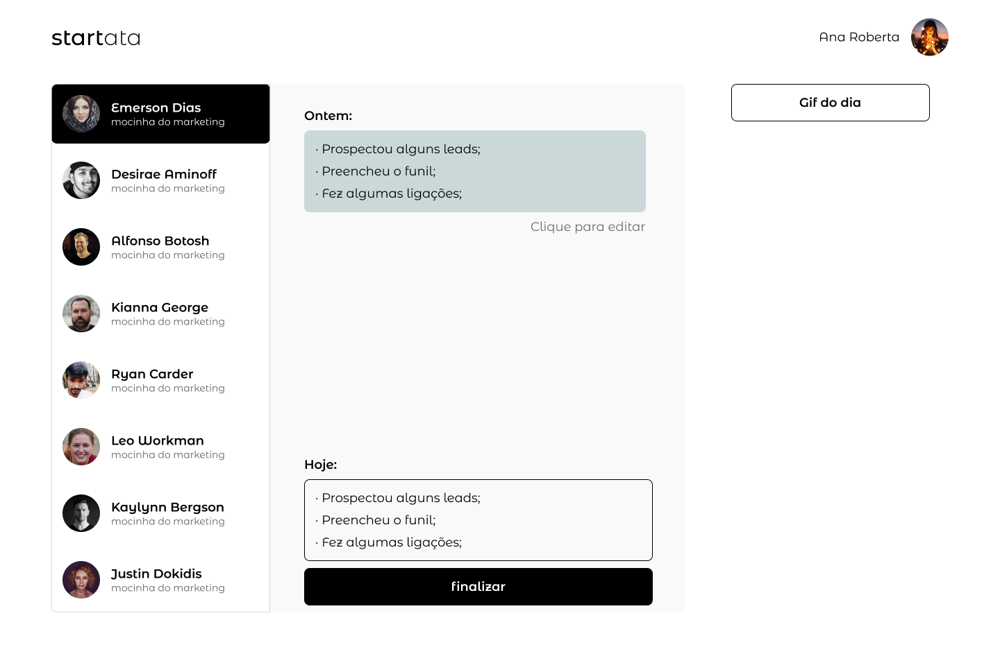

# :spiral_notepad: Startata: A Arte de atar 

Aplicação idealizada para a elaboração de [Atas](https://pt.wikipedia.org/wiki/Ata_de_reuni%C3%A3o), mais especificamente atas diárias que realizamos na Skwiz Labs.

## Funcionalidades - FrontEnd

:black_square_button:	fazer login
:black_square_button:	criar uma nova ata
:black_square_button:	inserir/editar um report de um usuário
:black_square_button:	salvar a ata
:black_square_button:	converter para um documento (.pdf)
:black_square_button:	enviar a ata para um e-mail listado

:black_square_button:	fazer download da ata em pdf

done	:white_check_mark: todo	:black_square_button:

## Features

*** V1 ***
- Confirmação de email para iniciar a ata
- Lista com todos os usuário em ordem alfabética e separados por time
- Ao chegar no ultimo usuário,
- Quem fez a ata também deve aparecer no template da Ata
*** V2 ***
- Se ao final da ata, não estão registrados todos os usuário o software deve agendar o envio da ata e enviar um email para os usuários que não estão presentes dando a possibilidade de adicionar seu registro a ata até o tempo agendado
- No final da ata, o usuário deve informar para qual email a ata deve ser enviada
- Botãozinho de download

## Telas

